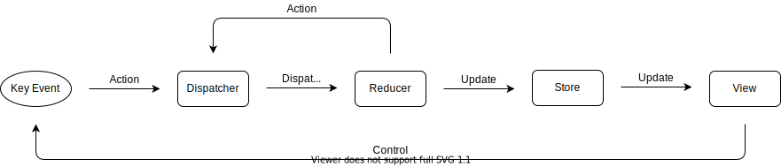

# tetris-CLI

Tetris running on the Shell with Go

## For Developer

### Architecture



### Installation

```sh
git clone https://github.com/mikiya771/tetris-CLI.git
cd tetris-CLI
```

### Run

```sh
go run main.go
```

### Test

```sh
go test -v ./...
ginkgo -r
```
